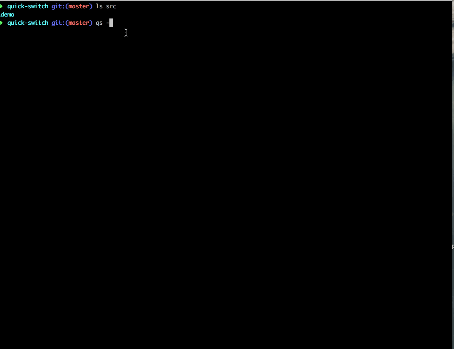

# qs

一个工具方便快速的根据已有模板生成新的项目

```bash
比如有如下目录结构，每个组件的处除了父目录的名字其他的文件结构都是一样的,这样就可以根据 qs 命令快速的创建新的组件
$ qs --new=nav // 根据_demo 生成 nav
---
- componets
  + _demo
  + button
  + row

  + nav

---
```

## 起步 `qs --init`

`--init` 主要是初始化 qs 的默认配置目前有四个个配置,生成的配置默认存在当前目录的 `.qsrc.json`文件中

- `root` 模板的根目录默认值为`src` (等同上文中的`components`)
- `defaultDemo` 默认模板默认值为 `_demo`（等同上文中`_demo`）
- `moduleStorePath` 当前选择的模块的存储路径默认值为 `./node_modules/.qsrc.json`
- `rename` 是否创建新模块的时候是时将新模块内的文件名字全部改为模块名,默认为`false`

```bash
以_demo 为模板生成nav 并且将文件名字全部改为nav
_demo
 _demo.xx
 _demo.xxx
 _demo.XXXX

nav
 nav.xx
 nav.xxx
 nav.XXXX
```


## 命令介绍

- `qs -h` 自行查看命令描述
- `qs --new=<name>` 根据默认模板创建新的项目
- `qs --switch=<name>` 将当前模块切换到对应名称的模块下,如果模块不存在则以当前模块为模板创建新的模块

```js
// qs 命令会记录当前切换到那个模块下，那记录这个有什么用呢，举个例子
// 比如我们一个工程有多个模块，每个模块单独打包,这样就可以通过读取`.qsrc.json`获取当前模块动态打包
// 也可以本地安装通过getConfig方法直接获取当前模块
const { getConfig } = require("qucik-switch")
const { currentModule } = getConfig()
module.exports = {
  entry: path.join(__dirname, "src", currentModule),
  mode: "development",
  context: __dirname,
  output: {
    filename: "bundle.js",
    path: path.resolve(__dirname, "build")
  }
}
```



## debug

将环境变量`DEBUG`设置为`qs` 当 debug 模式下会输出 qs 的配置和命令行参数信息

```js
  qs options +0ms
  qs { root: 'src',
  qs   defaultDemo: '_demo',
  qs   moduleStorePath: './node_modules/.qsrc.json',
  qs   currentModule: 'jjj',
  qs   _: [],
  qs   s: 'dddddd',
  qs   switch: 'dddddd',
  qs   '$0': 'qs' } +1ms
```

## TODO

- root 动态设置 root
- sourcename 自定义源
- [x] debug
- [x] copy 文件的同时 rename（为了满足微信小程序,貌似其他情况没有这种蛋疼的需求）
